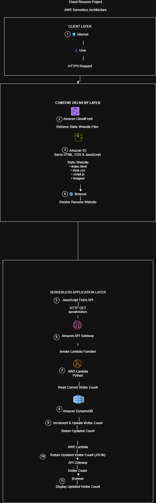
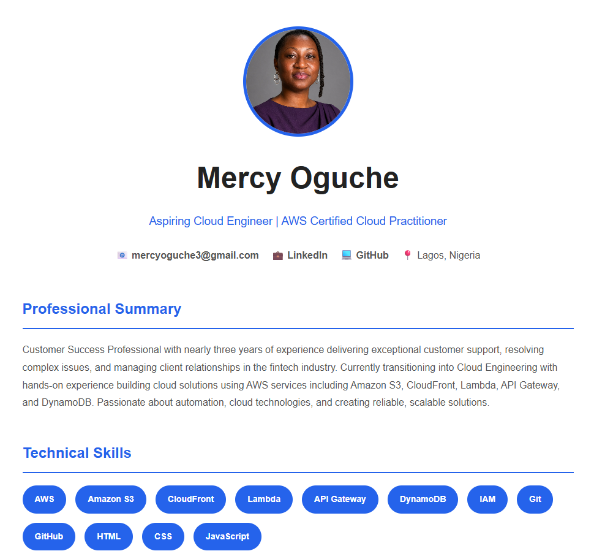
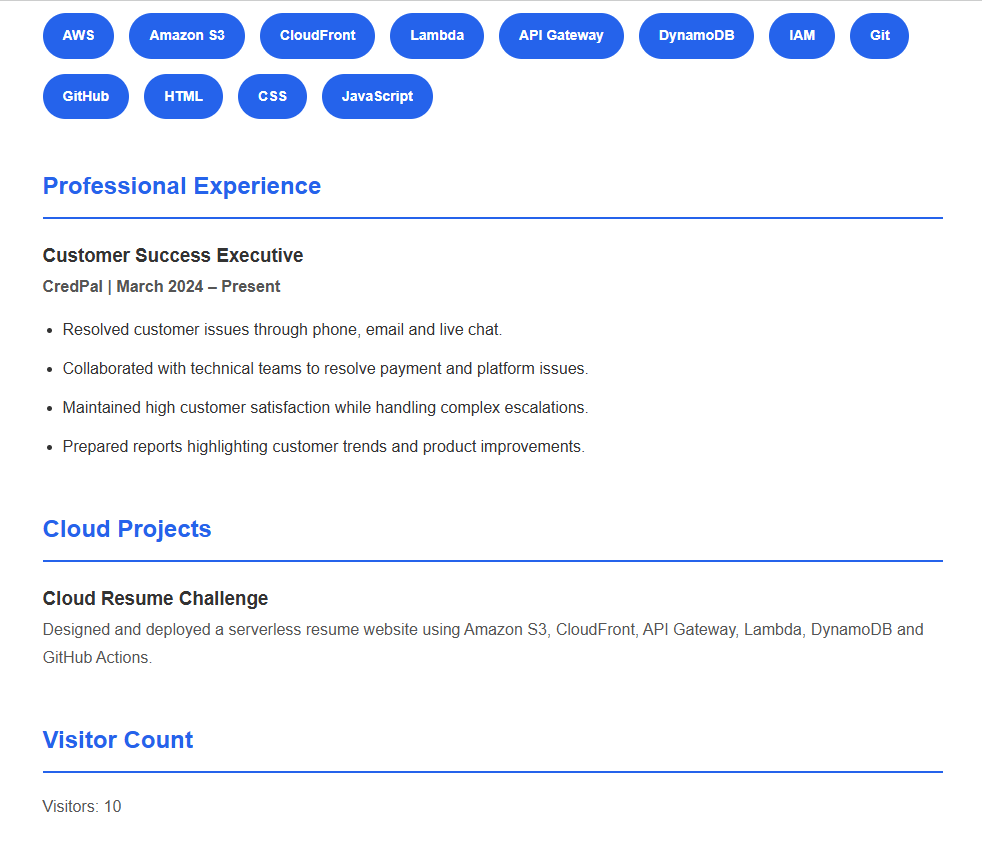
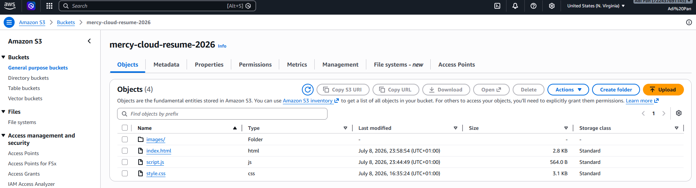
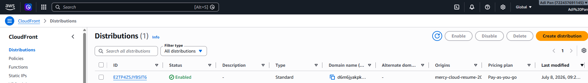
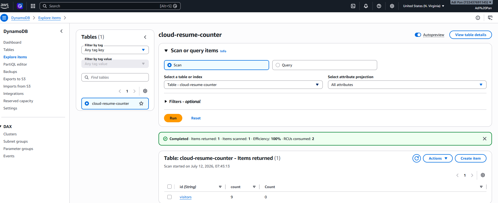
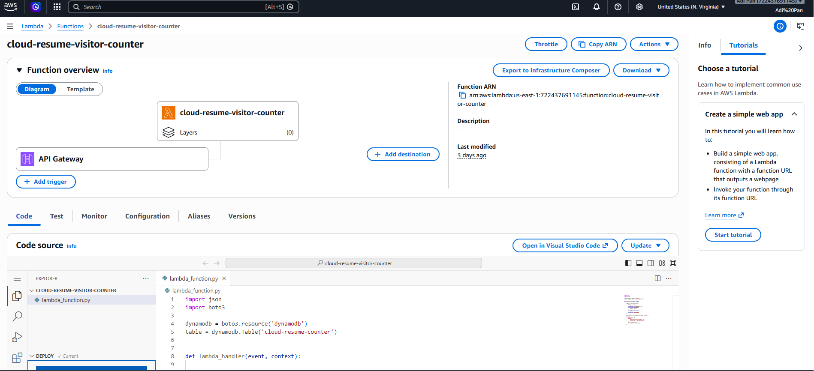
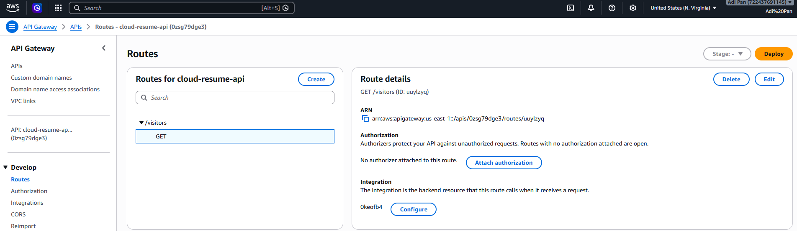

# ☁️ Cloud Resume Project

> Serverless resume website built using Amazon S3, CloudFront, API Gateway, AWS Lambda, Amazon DynamoDB, IAM, Git, and GitHub.


---

## 📌 Project Summary

| Category | Details |
|----------|---------|
| Project | Cloud Resume Project |
| Cloud Provider | Amazon Web Services (AWS) |
| Architecture | Serverless |
| Frontend | HTML, CSS, JavaScript |
| Backend | AWS Lambda (Python) |
| Database | Amazon DynamoDB |
| API | Amazon API Gateway |
| CDN | Amazon CloudFront |
| Hosting | Amazon S3 |
| Version Control | Git & GitHub |

---

## Table of Contents

- Project Overview
- AWS Architecture
- Project Goal
- Live Demo
- Development Journey
- Key Skills
- Challenges & Solutions
- Lessons Learned
- Key Takeaways
- Technologies used
- Project Timeline
- Project Outcome
- About the Author

---

# 📖 Project Overview

This project is my implementation of the **Cloud Resume Project**, designed to demonstrate practical cloud engineering skills by building and deploying a serverless resume website on Amazon Web Services (AWS).

The project combines frontend development, version control, cloud infrastructure, serverless computing, API development, and NoSQL databases into one complete cloud-native application.

Whenever a visitor opens the website, the visitor counter is automatically updated using AWS Lambda and Amazon DynamoDB.

---

# AWS Architecture

The diagram below illustrates the end-to-end serverless architecture used in this project.



---

# 🎯 Project Goal

The objective of this project was to gain hands-on experience with AWS by designing, building, and deploying a fully serverless resume website.

Throughout this project I learned how different AWS services work together to deliver a scalable cloud application while strengthening my understanding of cloud architecture and best practices.

---

# 🌐 Live Demo

**Website**

https://d6m6jyakpkwys.cloudfront.net

---

# 🛠 Development Journey (Start → Finish)

This section documents my complete development journey from setting up my local environment to deploying a fully functional serverless application on AWS.

---

# Phase 1 — Setting Up My Development Environment

## Step 1 — Installed Visual Studio Code

Downloaded and installed Visual Studio Code as my primary development environment.

**Purpose**

- Write HTML
- Write CSS
- Write JavaScript
- Manage project files
- Edit documentation

---

## Step 2 — Created a GitHub Account

Created a GitHub account to host the project repository and track version history.

**Skills Learned**

- Repository creation
- Version control concepts
- Source code management

---

## Step 3 — Installed Git

Installed Git on my computer.

Configured Git using:

```bash
git config --global user.name "mercyoguche3-netizen"
git config --global user.email "mercyoguche3@gmail.com"
```

These commands configured Git with my GitHub identity, allowing me to track commits and push changes to my GitHub repository.

Connected Git to GitHub for version control.

---

# Phase 2 — Creating the Resume Website

Created the following project structure:

```text
Cloud-Resume-Project
```

Created the project files:

```text
index.html
style.css
script.js
README.md
AWS-JOURNAL.md
```

---

## HTML Development

Built the structure of the resume website using HTML.

Included sections such as:

- Professional Summary
- Skills
- Work Experience
- Cloud Projects
- Visitor Counter
- Contact Information

---

## CSS Styling

Designed the website using CSS.

Implemented:

- Responsive layout
- Modern styling
- Typography
- Spacing
- Mobile-friendly design
- Responsive design for desktop and mobile devices

---

## JavaScript Development

Created the JavaScript file responsible for:

- Calling the visitor counter API
- Receiving JSON responses
- Updating the visitor counter dynamically

### 📸 Screenshot

The initial version of the resume website developed using HTML, CSS, and JavaScript.





---

# Phase 3 — Version Control with Git


After completing the initial version of my resume website, I used Git to manage version control throughout the project and GitHub to host the source code remotely. This allowed me to track changes, maintain a history of updates, and collaborate with cloud deployment workflows.

## Step 1 — Initialize the Git Repository

```bash
git init
```

Initialized a local Git repository inside the project folder.

---

## Step 2 — Stage Project Files

```bash
git add .
```

Added all project files to the staging area, including:

- `index.html`
- `style.css`
- `script.js`
- `README.md`
- `images/`

---

## Step 3 — Create the Initial Commit

```bash
git commit -m "Initial Resume Website"
```

Created the first commit to save the initial version of the project.

---

## Step 4 — Connect the Local Repository to GitHub

```bash
git remote add origin https://github.com/mercyoguche3-netizen/cloud-resume-project.git
```

Connected the local Git repository to the remote GitHub repository.

---

## Step 5 — Push the Project to GitHub

```bash
git branch -M main
git push -u origin main
```

Published the project to GitHub and established version control for future updates.

Throughout the development of this project, I continued using Git to track code changes, commit new features, resolve issues, and maintain a complete version history as additional AWS services were integrated into the solution.


## GitHub Repository

The complete source code for this project is maintained in a public GitHub repository using Git for version control.

Repository:

https://github.com/mercyoguche3-netizen/cloud-resume-project

---

# Phase 4 — Hosting the Website on Amazon S3

Created an Amazon S3 bucket.

Configured:

- Static Website Hosting

Uploaded:

- index.html
- style.css
- script.js
- images

Verified that the website loaded successfully.

📸 Screenshot:


---

# Phase 5 — Configuring Amazon CloudFront

Created an Amazon CloudFront Distribution.

Configured:

- Amazon S3 as the origin
- HTTPS enabled
- Default root object (index.html)
- Content caching
- Secure content delivery

CloudFront became the public entry point for the website.

📸 Screenshot:




---

# Phase 6 — Creating the Database

Created an Amazon DynamoDB table.

### DynamoDB Configuration

| Setting | Value |
|---------|-------|
| Table Name | `cloud-resume-counter` |
| Partition Key | `id` |
| Data Type | `String` |

Purpose:

Store and maintain the website visitor count across page refreshes.

📸 Screenshot:



---

# Phase 7 — Building the Backend

Created an AWS Lambda function using Python.

The Lambda function performs the following tasks:

- Connects to DynamoDB
- Reads the current visitor count
- Increments the count
- Updates the database
- Returns the updated visitor count

📸 Screenshot:



---

# Phase 8 — Building the API

Created an Amazon API Gateway.

Configured endpoint:

```text
GET /visitors
```

Integrated API Gateway with AWS Lambda.

Verified that the endpoint returned a JSON response containing the updated visitor count.

Example:

```json
{
    "visitors": 25
}
```

📸 Screenshot:



---

# Phase 9 — Connecting the Frontend to the Backend

Updated `script.js`.

Used the JavaScript Fetch API to call the API Gateway endpoint.

Example:

```javascript
fetch(API_URL)
```

The returned visitor count updates:

```html
<span id="counter"></span>
```

Verified that each page refresh triggered the API, incremented the DynamoDB counter, and displayed the updated visitor count on the webpage.
---

# Phase 10 — End-to-End Testing

Performed complete system testing.

Verified:

✅ Website loads successfully

✅ CloudFront serves content

✅ API Gateway receives requests

✅ Lambda executes successfully

✅ DynamoDB updates correctly

✅ Visitor counter displays correctly


---

# 🎯 Key Skills Demonstrated

Amazon S3
CloudFront
API Gateway
AWS Lambda
Amazon DynamoDB
IAM
REST APIs
Serverless Architecture
Cloud Security
HTML
CSS
JavaScript
Git
GitHub

---
# 🛠️ Challenges Encountered & Solutions

Throughout this project, I encountered several real-world challenges that required troubleshooting and a deeper understanding of AWS services. Solving these issues significantly improved my cloud engineering skills.

---

## Challenge 1 — CloudFront Returned a 403 Forbidden Error

### Problem

After deploying the website, CloudFront displayed a **403 Forbidden** error instead of loading the resume website.

### Root Cause

The S3 bucket policy and CloudFront Origin Access Control (OAC) permissions were not configured correctly.

### Solution

- Reviewed the S3 bucket policy.
- Configured CloudFront to access the S3 bucket using Origin Access Control (OAC).
- Updated the bucket policy to allow CloudFront to retrieve objects.
- Invalidated the CloudFront cache after applying the changes.

### Skills Gained

- CloudFront
- S3 Bucket Policies
- Origin Access Control (OAC)
- AWS IAM

---

## Challenge 2 — Images Were Not Displaying

### Problem

The profile image failed to load after deployment.

### Root Cause

The image path referenced in the HTML file did not match the folder structure uploaded to Amazon S3.

### Solution

- Verified the folder structure inside the S3 bucket.
- Updated the image path in the HTML file.
- Uploaded the corrected files.
- Cleared the CloudFront cache.

### Skills Gained

- Static Website Hosting
- Relative File Paths
- CloudFront Cache Management

---

## Challenge 3 — Visitor Counter Displayed "Loading..."

### Problem

The visitor counter remained on **Loading...** and never displayed a number.

### Root Cause

The JavaScript Fetch API could not successfully communicate with the API Gateway endpoint due to configuration issues.

### Solution

- Verified the API Gateway endpoint.
- Confirmed the Lambda function was deployed.
- Checked browser developer tools for JavaScript errors.
- Updated the API URL in `script.js`.
- Tested the API independently before reconnecting it to the frontend.

### Skills Gained

- JavaScript Fetch API
- Browser Developer Tools
- API Testing
- Debugging Frontend Applications

---

## Challenge 4 — Lambda Could Not Update DynamoDB

### Problem

The visitor count did not increase even though the Lambda function executed successfully.

### Root Cause

The Lambda execution role lacked sufficient IAM permissions to read and update the DynamoDB table.

### Solution

- Reviewed the Lambda execution role.
- Added the required DynamoDB permissions.
- Retested the API.

### Skills Gained

- IAM Roles
- Least Privilege Access
- DynamoDB Permissions

---

## Challenge 5 — API Gateway Configuration

### Problem

The API Gateway endpoint was not returning the expected JSON response.

### Root Cause

The route integration with AWS Lambda required additional configuration and deployment.

### Solution

- Configured the GET route.
- Connected the route to the Lambda function.
- Deployed the API.
- Tested the endpoint using the browser and API Gateway console.

### Skills Gained

- REST APIs
- API Gateway
- Lambda Integrations

---

## Challenge 6 — Git Merge Conflicts

### Problem

While updating the project repository, Git rejected a push because the local branch was behind the remote repository.

### Root Cause

The remote repository contained changes that were not present locally.

### Solution

- Pulled the latest changes from GitHub.
- Resolved merge conflicts.
- Completed the merge.
- Successfully pushed the updated code.

### Skills Gained

- Git
- GitHub
- Merge Conflict Resolution
- Version Control

---

## Challenge 7 — CloudFront Cache Did Not Reflect Changes

### Problem

After updating the website, CloudFront continued serving the old version.

### Root Cause

CloudFront cached the previous website content.

### Solution

- Created a CloudFront invalidation.
- Waited for cache propagation.
- Verified the updated website was served globally.

### Skills Gained

- CDN Caching
- CloudFront Invalidations
- Content Delivery Networks

# 📚 Lessons Learned

Through this project I gained practical experience with:

- Building cloud-native applications
- Static website hosting using Amazon S3
- Content delivery with CloudFront
- Creating REST APIs with API Gateway
- Serverless computing using AWS Lambda
- NoSQL databases using DynamoDB
- IAM permissions and security
- Connecting frontend applications to AWS backend services
- Git and GitHub version control
- Debugging and troubleshooting cloud infrastructure

---

## Key Takeaways

This project taught me that building cloud applications involves much more than deploying resources. I gained practical experience troubleshooting infrastructure, configuring security permissions, debugging APIs, integrating frontend and backend services, and resolving deployment issues. These experiences strengthened both my AWS knowledge and my problem-solving skills.

# 🚀 Technologies Used

| Technology | Purpose |
|------------|---------|
| HTML5 | Resume website structure |
| CSS3 | Styling and responsive layout |
| JavaScript | API integration |
| Git | Version control |
| GitHub | Source code hosting |
| Amazon S3 | Static website hosting |
| CloudFront | Global content delivery |
| API Gateway | REST API |
| AWS Lambda | Serverless backend |
| DynamoDB | Visitor counter database |
| IAM | Secure permissions |


---

## 📅 Project Timeline

| Phase | Task | Status |
|--------|------|--------|
| ✅ | Installed VS Code & Git | Completed |
| ✅ | Created GitHub Repository | Completed |
| ✅ | Built Resume Website (HTML/CSS/JS) | Completed |
| ✅ | Hosted Website on Amazon S3 | Completed |
| ✅ | Configured CloudFront Distribution | Completed |
| ✅ | Created DynamoDB Table | Completed |
| ✅ | Built Visitor Counter Lambda | Completed |
| ✅ | Created API Gateway | Completed |
| ✅ | Connected Frontend to Backend | Completed |
| ✅ | Tested End-to-End Workflow | Completed |
| ✅ | Created AWS Architecture Diagram | Completed |
| ✅ | Documented Project | Completed |

---

## ✅ Project Outcome

Successfully designed and deployed a serverless resume website using AWS services.

The solution demonstrates:

- Static website hosting
- Content delivery with a CDN
- Serverless backend development
- REST API integration
- NoSQL database implementation
- IAM permission management
- Frontend and backend integration

---

# 👩🏽‍💻 About the Author

## Mercy Oguche

Aspiring Cloud Engineer passionate about designing secure, scalable, and serverless solutions on AWS.


### Connect with Me

**GitHub**

[GitHub](https://github.com/mercyoguche3-netizen)

**LinkedIn**

[LinkedIn](https://www.linkedin.com/in/mercyoguche3)

**Email**

mercyoguche3@gmail.com